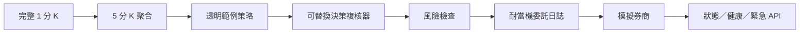

# TickForge Community

[](https://github.com/k1everwann/tickforge-community/actions/workflows/ci.yml)
[](LICENSE)

一個以「模擬優先、失敗時禁止交易、決策可稽核」為核心的開源交易研究框架。

公開版只提供可學習、測試與擴充的通用安全骨架，不包含正式券商 adapter、實際交易參數、
私人 Prompt、交易紀錄、部署位置或帳戶資料，也不會連接正式帳戶。

> **重要：** 本專案僅供教育與研究，不是投資建議，也不保證獲利。預設與內建模式永遠是
> `SIMULATION_ONLY`。請先閱讀 [DISCLAIMER.md](DISCLAIMER.md)。

## 為什麼做這個專案

自動交易最困難的部分通常不是產生買賣訊號，而是處理「委託送出後斷線了怎麼辦」、券商狀態不明、
重複委託、停損、監控失效與緊急處理。這個社群版把這些工程問題放在策略之前。

## 服務角色

下列連接埠只是公開參考架構中的本機預設，不代表任何實際部署位置：

| Port | 服務 | 功能 |
| --- | --- | --- |
| `5001` | TickForge Market | 接收與正規化行情、建立完整 K 線、提供唯讀市場狀態 |
| `5002` | TickForge Analytics | 保存歷史資料、回放、績效統計與研究結果 |
| `5003` | TickForge Trader | 模擬策略、風控、委託狀態、健康檢查、緊急控制與 dashboard |

目前 repo 直接提供可執行的 `5003` simulation starter；`5001` 與 `5002` 是清楚分離的服務邊界，
方便社群自行接入合法取得的行情來源與分析儲存層。



## 已包含

- 完整 1 分 K 輸入與 5 分 K 聚合
- 可讀、可測試的做多範例策略
- 可替換的規則或 AI `DecisionReviewer` 介面
- 單一做多部位範例、停損距離與當日損失限制
- SQLite 委託意圖日誌；任何不明委託狀態都會 fail closed
- 硬停損與兩階段緊急平倉
- `/api/state`、`/api/health` 與簡易瀏覽器 dashboard
- 可獨立執行的健康監控，以及 CSV 歷史 1 分 K 回放
- 固定 seed 的合成行情，可重現測試
- Docker、pytest、ruff 與 GitHub Actions

## 刻意不包含

- 正式券商登入、憑證啟用或下單程式
- 真實行情授權資料與個人帳戶資料
- 宣稱可獲利的「黑盒策略」
- 任何個人策略、Prompt、資金、部署與維運設定

## 五分鐘快速開始

需求：Python 3.11 或更新版本。

```bash
git clone https://github.com/k1everwann/tickforge-community.git
cd tickforge-community
python -m venv .venv
```

Linux/macOS：

```bash
source .venv/bin/activate
python -m pip install -e ".[dev]"
tickforge demo --bars 600
tickforge serve
```

Windows PowerShell：

```powershell
.venv\Scripts\Activate.ps1
python -m pip install -e ".[dev]"
tickforge demo --bars 600
tickforge serve
```

開啟 <http://127.0.0.1:5003/>，按「產生 30 根模擬 1 分 K」即可觀察完整流程；OpenAPI 文件在
<http://127.0.0.1:5003/docs>。

也可以使用 Docker：

```bash
docker compose up --build
```

CSV 欄位為 `timestamp,open,high,low,close,volume`，時間必須包含時區：

```bash
tickforge replay examples/sample-bars.csv
tickforge monitor --once
```

## API 安全

狀態與健康端點唯讀。資料寫入、暫停、恢復及緊急流程需要 `X-TickForge-Token`，除非是 dashboard
專用的合成行情按鈕。若 API 綁定到非 loopback 位址，啟動時會強制要求至少 32 字元的控制權杖。

```bash
cp .env.example .env
# 將 TICKFORGE_CONTROL_TOKEN 改成隨機長字串，再由 shell 載入環境變數。
```

不要把服務直接暴露到公網。請參閱 [SECURITY.md](SECURITY.md)。

## 接入自己的分析或 AI

實作 `DecisionReviewer` 即可在候選訊號與風控之間加入自己的規則或模型：

```python
from tickforge.models import Action, Decision

class MyReviewer:
    def review(self, candidate, bars):
        if candidate.action is Action.OPEN_LONG and candidate.confidence < 0.8:
            return Decision(Action.HOLD, "review confidence too low")
        return candidate
```

複核器不能繞過 `RiskManager` 或委託狀態日誌。這是刻意的安全邊界。

## 開發

```bash
python -m pip install -e ".[dev]"
ruff check .
pytest --cov=tickforge --cov-report=term-missing
```

歡迎改善模擬、測試、可觀測性與安全設計。請先閱讀 [CONTRIBUTING.md](CONTRIBUTING.md)。

## License

Apache License 2.0。詳見 [LICENSE](LICENSE)。
